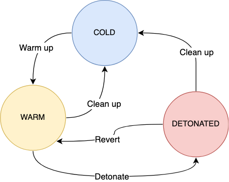

# Getting Started

## Concepts

### Attack Techniques

An *attack technique* is a granular TTP that has *pre-requisites* infrastructure or configuration.
You can see the list of attack techniques supported by Stratus Red Team [here](../attack-techniques/list.md).

### Warm-up Phase

*Warming up* an attack technique means making sure its pre-requisites are met, without detonating it. 
Warm up is a preparation phase, before executing the actual attack.

Behind the scenes, Stratus Red Team transparently uses Terraform to spin up and tear down the pre-requisites of each attack technique.


### Detonation Phase

An attack technique can be *detonated* to execute it against a live environment, for instance against a test AWS account.

### Reverting and Cleaning up an Attack Technique

*Reverting* an attack technique means "cancelling" its detonation, it had a side effect. *Cleaning up* an Attack Technique means nuking all its pre-requisites and making sure no resource is left in your environment.

### State Machine

The diagram below illustrates the different states in which an attack technique can be.

<figure markdown>

<figcaption>State Machine of a Stratus Attack Technique</figcaption>
</figure>

### Example

Let's take an example. The attack technique [Exfiltrate EBS Snapshot through Snapshot Sharing](../../attack-techniques/AWS/aws.exfiltration.ebs-snapshot-shared-with-external-account/) is comprised of two phases:

- Warm-up: Create an EBS volume and a snapshot of it
- Detonation: Share the EBS snapshot with an external AWS account
- Revert: Unshare the EBS snapshot with the external AWS account
- Clean-up: Remove the EBS volume and its snapshot

## Sample Usage

Stratus Red Team is a self-contained Go binary, embedding all the attack techniques it supports emulating.

You can list available attack techniques using:

```bash
stratus list
```

Detonating a specific attack technique is as simple as running:

```bash
stratus detonate aws.exfiltration.ebs-snapshot-shared-with-external-account
```

You will get an output similar to:

```
2022/01/18 22:32:11 Checking your authentication against the AWS API
2022/01/18 22:32:12 Warming up aws.exfiltration.ebs-snapshot-shared-with-external-account
2022/01/18 22:32:12 Initializing Terraform
2022/01/18 22:32:19 Applying Terraform
2022/01/18 22:32:43 Sharing the volume snapshot with an external AWS account ID...
```

You can then clean up any leftovers from the technique, which in this case will remove the EBS volume and EBS snapshot:

```bash
stratus cleanup aws.exfiltration.ebs-snapshot-shared-with-external-account
```

For more information, see [Usage](./usage.md).

## Installation

- Mac OS: 

```
brew tap datadog/stratus-red-team
brew install datadog/stratus-red-team/stratus-red-team
```

- Linux / Windows: Download one of the [pre-built binaries](https://github.com/datadog/stratus-red-team/releases).

- Docker:

```
docker pull ghcr.io/datadog/stratus-red-team
docker run --rm ghcr.io/datadog/stratus-red-team
```

## Connecting to your cloud account

Stratus Red Team currently supports only AWS. In order to use Stratus attack techniques against AWS, you need to be authenticated prior to running it, for instance:

- Using [`aws-vault`](https://github.com/99designs/aws-vault)

- Using static credentials in `~/.aws/config`, and setting your desired AWS profile using `export AWS_PROFILE=my-profile`

Before running an AWS attack technique, Stratus will attempt to call `sts:GetCallerIdentity` and raise an error if this fails.


*[TTP]: Tactics, techniques and procedures